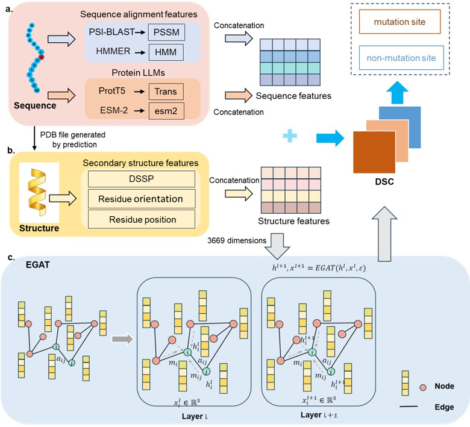

## Installation

1.) We recommend conda virtual environment to install dependencies for EquiPNAS. The following command will create a virtual environment named 'EG-ARG'

`conda env create -f environment.yml`

2.) Then activate the virtual environment

`conda activate EG-ARG`

## Usage

To see usage instructions, run 
`cd /EG-ARG/train_scripts`
`python train_model_gat_cnn.py`
